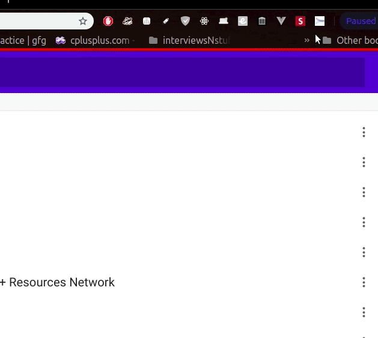

# getmeQR
*if there is any reason for you to get all your browser tabs to your smart phone, getmeQR is here.*

## how it works


## How to get it?
```
- currently it is not on google chrome app store and neither available as mozilla-firefox addons,
so all you can do is to clone this repo and load the unpacked extension(Check out google for it). 

```
## NOTE
`i built it for my personal use, if you want to add some personalised features to it, make a PR or an issue for it. `
